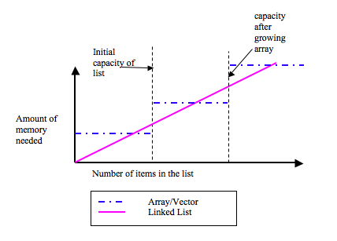

# Implementation

There are two typical ways to implement a list.  The first is to use an array like data structure, the second is to use a linked list data structure.  There are advantages and disadvantages to each implementation.

If you used array, items are stored in memory consecutively and you can have direct access to any particular item through the use of its index in constant time.  When sorted, the list can be searched using binary search.  Making the list grow can be expensive and space is often wasted as large amount of space may be allocated but not used

A linked list is very easy to grow and shrink.  Data is not stored in consecutive memory locations so a large block of contiguous memory is not required even for storing large amounts of data. Each piece of data requires the storage of an extra pointer.  However, the amount of extra data is related to number of items in the list already.  A linked list cannot be searched using binary search as direct access to nodes are not available.

## Memory Requirements

To implement a list using arrays, we allocate more space than is necessary.  The array is used until it is full.  Once an array is full, either all new insertions fail until an item is removed or the array must be reallocated.  The reallocation typically involves creating a larger array, copying over the old data, and making this the array.  As the process of growing an array requires the typically copying of the entire array, this is not something you want to do often.  That is, you do not grow the array a few elements at a time but in large chunks instead.  The exact number of elements to grow by is implementation specific.

To implement a list using a linked list like structure, each value is put into its own data node.  Each node in the list is then linked with the next node by storing the address of the next node in the list.  The memory usage in this case is at least one extra pointer for each piece of data.  However, nodes are created on an as needed basis.  There are never have unused nodes.  Thus, the amount of memory used to store data in a linked list structure is typically lower than an array until the array is nearly full.

